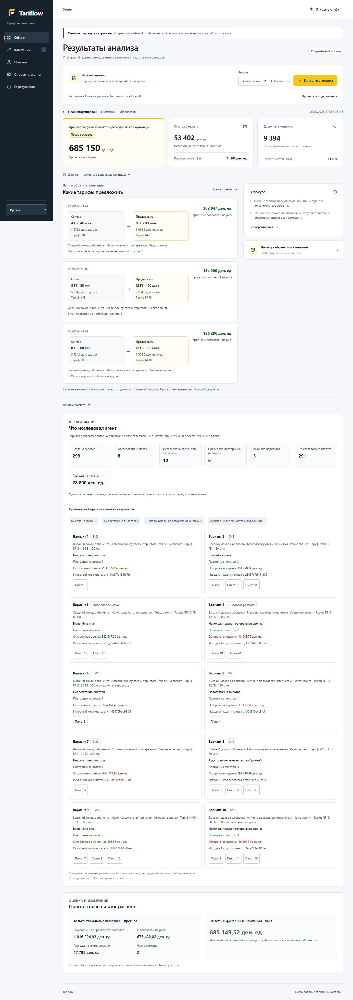

# Tariflow

**Агент планирования тарифных маркетинговых кампаний:** исследует аудиторию, проверяет гипотезы пилотами и формирует план в пределах бюджета и лимита контактов.

Проект решает **Beeline Tariff Marketing Campaigns Case**: 23 441 абонент, 21 тариф, четыре канала коммуникации, до 20 пилотов и до 10 финальных кампаний. Основной пользователь — маркетинговый аналитик, планирующий кампании на следующий месяц.

Все данные, тарифы и эффекты синтетические. Результаты относятся к учебной симуляции; приложение не подключается к системам Beeline и не отправляет сообщения абонентам.

**Навигация:** [запуск](#запуск-из-чистого-checkout) · [требования ТЗ](#соответствие-тз) · [алгоритм](#как-работает-агент) · [интерфейс](#веб-интерфейс-и-демо) · [результаты](#подтверждённые-результаты) · [проверки](#проверки-и-воспроизводимость) · [сдача](#артефакты-для-сдачи) · [развитие](#ограничения-и-развитие).

## Проблема и решение

Смена тарифа может увеличить выручку, не изменить её или привести к downsell. Контакт тоже расходует ресурсы: более дорогой канал не обязательно окупится на выбранном сегменте. Публичная история относится к другой выборке абонентов, поэтому историческое среднее нельзя напрямую переносить на текущую аудиторию.

Tariflow использует историю для построения гипотез, а решение о кампании уточняет по результатам публичных пилотов. Аналитик получает сегмент, целевой тариф, канал, прогноз расходов, осторожную оценку эффекта и ссылки на наблюдения, объясняющие выбор. Это автоматизирует перебор и делает решение проверяемым; фактическая экономия времени аналитика отдельно не измерялась.

Основной сценарий:

1. Запустить агента на текущем профиле аудитории.
2. Дождаться исследования: гипотезы → пилоты → обновление оценок.
3. Просмотреть выбранные кампании, ресурсы и причины исключения альтернатив.
4. Проверить результат официальным evaluator и сформировать `submission.csv`.

## Соответствие ТЗ

| Обязательное требование | Реализация | Как проверить |
|---|---|---|
| `agent.py`, класс `Agent`, метод `act(env)` | Агент возвращает `list[dict]` через официальный интерфейс | `python local_eval.py` завершается со статусом `PASS` |
| От 1 до 10 корректных кампаний | Допустимые фильтры, тарифы, каналы и размеры аудиторий | Нет отброшенных кампаний; контрольный seed 42 даёт 3 финальные кампании |
| Пилоты влияют на решение | `env.run_pilot` обновляет оценки следующих проверок и итогового плана | Контрольный запуск проводит 20 пилотов; логика — в `Agent.act` |
| Ресурсные лимиты соблюдены | Учитываются пилотные и финальные расходы, контакты и пересечения | Контроль: 46 598 / 100 000 у.е., 5 606 / 15 000 контактов |
| Воспроизводимый официальный CSV | Файл создаёт исходный `make_submission.py` | `python make_submission.py`; проверка совпадения модульного и standalone запуска |

Все ограничения действуют одновременно:

| Ограничение | Значение |
|---|---:|
| Общий бюджет, включая пилоты | 100 000 у.е. |
| Все контакты, включая пилотные и повторные | 15 000 |
| Финальные кампании | 1–10 |
| Аудитория одной финальной кампании | Не более 5 000 |
| Число пилотов | Не более 20 |
| Размер одного пилота | 10–200 абонентов |
| Время работы по ТЗ, включая обращения к модели | Не более 10 минут |

Метрика кейса:

```text
Чистый результат = прирост ARPU по уникальным абонентам
                   − стоимость всех контактов, включая пилоты
```

Эффект пропорционален `predicted_arpu` конкретного абонента. При повторных контактах учитывается лучший эффект для абонента, но расходы повторных контактов сохраняются. Базовая выручка 150 641 084 у.е. не является приростом.

| Канал | Стоимость контакта | Публичный множитель эффекта в кейсе |
|---|---:|---:|
| `push` | 0 у.е. | ×0,50 |
| `sms` | 4 у.е. | ×0,65 |
| `digital_ads` | 22 у.е. | ×0,85 |
| `call` | 160 у.е. | ×1,20 |

Источники требований: [guide участника](PARTICIPANT_GUIDE.md), [ТЗ с критериями оценки](docs/CHALLENGE_ORIGINAL.txt). Границы проекта — [PROJECT](docs/PROJECT.md).

## Запуск из чистого checkout

### Требования к окружению

| Инструмент | Для чего нужен |
|---|---|
| Python **3.12** | Агент, официальный evaluator, локальный сервер и упаковка |
| `pandas==3.0.1`, `numpy==2.3.5` | Обработка данных; версии закреплены в `requirements.txt` |
| Git | Клонирование, версия в manifest и сравнение ревизий |
| PowerShell **7** (`pwsh`) и **ripgrep** (`rg`) | Полный скрипт `scripts/verify.ps1`, включая проверку секретов |
| Node.js | Только веб-тесты; проверено на 24.19.0, npm-зависимостей нет |
| Браузер | Необязательный локальный интерфейс |

Официальный автономный запуск не требует Node.js, PowerShell 7, браузера или ключа OpenAI. Интернет нужен для клонирования и установки зависимостей; после установки offline-расчёт работает без сети. Проверенное окружение: Python 3.12.14, pandas 3.0.1, NumPy 2.3.5.

Получите проект и перейдите в его корень:

```sh
git clone https://github.com/BAITC-Hacks/hack-25081c1e-1718.git
cd hack-25081c1e-1718
```

### Windows — PowerShell

Убедитесь, что `python --version` показывает Python 3.12. Если установлено несколько версий, для создания окружения можно использовать `py -3.12 -m venv .venv` вместо второй команды.

```powershell
python --version
python -m venv .venv
.\.venv\Scripts\python.exe -m pip install -r requirements.txt
$env:ARPU_PYTHON = (Resolve-Path .\.venv\Scripts\python.exe).Path
$env:ARPU_OFFLINE = '1'

& $env:ARPU_PYTHON -X utf8 local_eval.py
& $env:ARPU_PYTHON -X utf8 local_eval.py --runs 10
& $env:ARPU_PYTHON -X utf8 make_submission.py
```

### Linux / macOS — bash или zsh

```sh
python3.12 --version
python3.12 -m venv .venv
.venv/bin/python -m pip install -r requirements.txt
export ARPU_PYTHON="$PWD/.venv/bin/python"
export ARPU_OFFLINE=1

"$ARPU_PYTHON" -X utf8 local_eval.py
"$ARPU_PYTHON" -X utf8 local_eval.py --runs 10
"$ARPU_PYTHON" -X utf8 make_submission.py
```

В следующих примерах используется созданное окружение: Windows — `& $env:ARPU_PYTHON`, Linux/macOS — `"$ARPU_PYTHON"`. Активация `.venv` не требуется. Переменные нужно задать снова при открытии нового терминала. `-X utf8` предотвращает ошибки кодировки русского вывода в Windows.

### Что должно получиться

Одиночный `local_eval.py` использует seed 42, `--runs 10` — seed 0–9. Для контрольного автономного запуска ожидаются:

| Показатель | Результат |
|---|---:|
| Статус evaluator | PASS |
| Чистый результат | 685 149,52 у.е. |
| Финальные кампании / пилоты | 3 / 20 |
| Расход с пилотами | 46 598 у.е. |
| Контакты с пилотами | 5 606 |
| Уникальные абоненты | 2 903 |

Официальный вывод округляет net до `685150`. Его строка `Кампаний: 23` включает 20 пилотов и 3 финальные кампании и не означает превышения лимита финального плана.

После `make_submission.py` в корне появляется `submission.csv` с тремя строками кампаний и семью колонками:

```text
campaign_name,filter_arpu_segment,filter_data_segment,filter_call_segment,filter_current_tariff,target_tariff,channel
```

В выходе `Agent.act` обязательны `target_tariff` и `channel`; пропущенный фильтр означает отсутствие ограничения. Несколько текущих тарифов в `filter_current_tariff` разделяются `;`. Имена кампаний служат стабильными техническими идентификаторами.

## Как работает агент

Tariflow реализует один управляющий `Agent` с инструментом `env.run_pilot`, состоянием наблюдений и циклом пересмотра решений. Модули кандидатов, оценивания и советника работают внутри этого цикла.


1. **Построение гипотез.** `candidate_model.py` использует сегменты по ARPU, данным, звонкам и текущему тарифу. Кандидаты опираются на поля каталога, а не порядок номеров `tariff_N`. Фильтр должен точно описывать аудиторию: большую группу нельзя просто обрезать и вернуть прежний фильтр.
2. **Осторожный перенос истории.** История переходов принадлежит другой выборке. Её ID не соединяются с ID целевой базы. Дубликаты и некорректные знаменатели исключаются; исторические отношения ограничиваются и сглаживаются. В ядре вклад истории ограничен пятью псевдонаблюдениями, поэтому наблюдения пилотов имеют приоритет.
3. **Разведка и обновление.** Агент проводит пилоты через публичный API, перечитывает фактический размер, эффект и остатки ресурсов. Следующие проверки зависят от полученных результатов. Обычный режим использует первые пилоты до 150 и повторные до 200 клиентов; размеры по этапам фиксированы.
4. **Подтверждение и канал.** Для обычного включения в план нужны два завершённых пилота выбранного кандидата именно на его канале. Публичные множители помогают выбрать, что проверить, но наблюдения SMS не выдаются за измерение эффекта рекламы. Для подтверждённых гипотез агент может проверить более дорогой канал с резервом на пилоты и финальную кампанию.
5. **Неопределённость и ресурсы.** Из оценки эффекта вычитаются коммуникационные расходы и эвристический запас неопределённости. Размер выборки влияет на этот запас. Это осторожная эвристика, а не калиброванный доверительный интервал.
6. **Выбор набора.** Для небольшого пула допустимых вариантов используется ограниченный перебор совместимых наборов; для большего — жадный выбор. Учитываются бюджет, контакты, пересечение аудиторий и максимум 10 кампаний. Если положительного допустимого набора нет, возвращается обязательная резервная кампания с предупреждением; прибыль такого fallback не гарантируется.

Основной режим — `baseline/template/fixed`. Экспериментальные политики `balanced`, `confirmation_first`, эмпирическая неопределённость и адаптивный размер пилота реализованы отдельно и не включены по умолчанию: сравнительные испытания не подтвердили их преимущество.

Для разведочного цикла предусмотрен порог времени 220 секунд; локальный веб-сервер ограничивает дочерний расчёт 300 секундами. Это отдельные предохранители, а не доказательство соблюдения глобального лимита на любом оборудовании. Полный запуск следует проверять в целевом окружении.

Подробности: [ARCHITECTURE](docs/ARCHITECTURE.md), [анализ публичных данных](analysis/README.md), [схема отчёта](docs/REPORT_SCHEMA.md).

## Данные и технологии

| Файл | Роль |
|---|---|
| `customer_profile.csv` | Целевая база, сегменты, текущий тариф, потребление и `predicted_arpu` |
| `tariff_dictionary.csv`, `feature_dictionary.csv` | Каталог тарифов и описание признаков |
| `data/change_tariff.csv` | Публичная история переходов для слабых исторических приоров |
| `data/traffic.csv`, `data/arpu_monthly.csv`, `data/dict_tariff.csv` | Дополнительная история и справочники для аудита данных |

Генератор кандидатов во время расчёта читает историю переходов и переданные публичные таблицы профиля/тарифов. Остальные исторические файлы не объявляются дополнительными обучающими признаками модели. [Аудит](analysis/README.md) описывает сдвиг выборки, пропуски, дубликаты и ограничения переноса истории.

Стек: **Python 3.12 + pandas + NumPy**, стандартная библиотека для HTTP, JSON и упаковки; **HTML/CSS/JavaScript modules** для интерфейса. Базы данных, сборщика frontend и обязательного облачного сервиса нет. В разработке использован Codex.

## Необязательный OpenAI-режим

Агент может обратиться к OpenAI Responses API до двух раз: перед первыми пилотами и после обратной связи. Советник получает ограниченный набор уже созданных гипотез и наблюдений и предлагает приоритеты существующих `candidate_id`. Он не меняет фильтры, каналы, бюджет или правила допустимости. Ответ проверяется по схеме и допустимым идентификаторам.

Один запрос советника ограничен таймаутом 15 секунд и 900 выходными токенами. Отсутствие ключа, ошибка сети, таймаут или невалидный ответ переводят расчёт на автономную логику. Воспроизводимые показатели в этом README получены в offline-режиме.

| Переменная | Назначение |
|---|---|
| `ARPU_OFFLINE=1` | Принудительно отключить сетевые советы |
| `OPENAI_API_KEY` | Ключ только из окружения процесса |
| `OPENAI_MODEL` | Необязательная модель; значение по умолчанию указано в `.env.example` |
| `ARPU_PYTHON` | Интерпретатор для PowerShell-проверок; к стратегии отношения не имеет |

Для локального демо ключ можно ввести скрыто в терминале:

```powershell
& $env:ARPU_PYTHON -X utf8 server.py --ask-key
```

Linux/macOS: `"$ARPU_PYTHON" -X utf8 server.py --ask-key`. Опция действует на текущий процесс и отключает в нём ранее заданный offline-режим. Для прямого `local_eval.py` с ключом в окружении необходимо снять `ARPU_OFFLINE`: `Remove-Item Env:ARPU_OFFLINE -ErrorAction SilentlyContinue` в PowerShell или `unset ARPU_OFFLINE` в bash/zsh. Файлы `.env` автоматически не загружаются; `.env.example` содержит только пример имён настроек.

Ключ не передаётся браузеру и не сохраняется приложением. Вызовы внешнего API могут тарифицироваться. Наличие ключа не означает, что совет был получен и принят: фактический режим отражается в отчёте.

## Веб-интерфейс и демо

### Запуск приложения

После подготовки Python-окружения:

```powershell
& $env:ARPU_PYTHON -X utf8 server.py --offline
```

Linux/macOS: `"$ARPU_PYTHON" -X utf8 server.py --offline`.

Откройте [http://127.0.0.1:8765](http://127.0.0.1:8765), выберите автономный режим, оставьте seed 42 и нажмите **«Запустить анализ»**. Дождитесь завершения. Остановка сервера — `Ctrl+C`. Сразу после старта отчёта ещё нет; «Открыть последний расчёт» работает после первого успешного прогона.

Интерфейс поддерживает русский и казахский языки и показывает:

- измеренный итог симуляции, использованные ресурсы и плановые остатки;
- исследованные гипотезы, варианты с каналами, повторные пилоты и причины исключения;
- карточки кампаний с оценкой, неопределённостью и ссылками на собственные пилоты;
- таблицы наблюдений и объяснения по текущему серверному снимку;
- реальные состояния загрузки, ошибки, пустого и сохранённого отчёта.

**Прогноз и измеренный итог имеют разный состав:** `forecast_summary` оценивает только финальные кампании, а `evaluation` включает пилоты и финальные кампании с дедупликацией. Их разность нельзя интерпретировать как ошибку прогноза. Сумма размеров пилотов — число контактов, а не обязательно уникальных людей.

Ответы по отчёту не запускают кампании и не меняют план. Числовая сводка формируется из фактов снимка; необязательная модель добавляет качественное пояснение. Каждый вопрос обрабатывается отдельно, без памяти предыдущего диалога. Автономный ответ и ответ модели явно различаются; неподдерживаемые ссылки и известные ошибки ответа вызывают fallback. Контракт — [API](docs/API.md).

<details>
<summary>Реальные скриншоты интерфейса</summary>

Обзор на русском, 1440 px, синтетический автономный запуск:



[Казахский интерфейс, 1440 px](web/screenshots/overview-kk-1440.png) · [мобильный, 375 px](web/screenshots/overview-ru-375.png) · [планшет, 768 px](web/screenshots/overview-ru-768.png). В `web/screenshots/` сохранены все шесть снимков RU/KK. Изображения доступны в полном репозитории и не входят в небольшой архив агента; для просмотра закрытого репозитория нужен доступ GitHub.

</details>

### Просмотр сохранённого отчёта без API

```powershell
& $env:ARPU_PYTHON -X utf8 scripts/run_agent.py --offline
& $env:ARPU_PYTHON -m http.server 8080 --bind 127.0.0.1 --directory web
```

Linux/macOS: выполните те же команды с `"$ARPU_PYTHON"` вместо `& $env:ARPU_PYTHON`. Откройте [http://127.0.0.1:8080](http://127.0.0.1:8080) и импортируйте `output/report.json`. Импорт остаётся в браузере. Запуск расчёта и вопросы требуют локального API на 8765 и его собственного снимка; произвольный импорт не становится серверным отчётом.

**Демо за две минуты:** запуск → итог и ресурсы → исследованные гипотезы → выбранная кампания и её пилоты → объяснение → официальный CSV. Подробный сценарий и проверка состояний — [DEMO](docs/DEMO.md).

## Подтверждённые результаты

Все суммы ниже — чистый результат синтетической симуляции, а не оценка реальной выручки оператора. Серии имеют разные seed и назначение; их нельзя объединять в один показатель «точности».

| Проверка | Объём | Результат | Доказательства |
|---|---|---|---|
| Контроль и standalone-поставка | Seed 42 | Net **685 149,52**; модульный и самостоятельный агент совпадают точно, CSV — побайтно | [Release-протокол](docs/quality/followup-release.json) |
| Официальная устойчивость | Seed 0–9 | **10/10 положительных**; медиана **615 745**, минимум **418 038** (округлено) | [Официальный журнал](docs/quality/official-runs-10.txt) |
| Разработческое сравнение | Seed 200–209, 7 режимов, 70 запусков | Все запуски технически валидны; ни один экспериментальный режим не прошёл условия замены основного | [Исходные результаты](docs/quality/followup-development.json) |
| Независимая проверка | Seed 300–319, 2 режима, 40 запусков | Основной и адаптивный режимы: **20/20 положительных** каждый; преимущество адаптивного не подтверждено | [Исходные результаты](docs/quality/followup-holdout.json) |

Результаты независимой серии:

| Режим | Медиана net | 10-й процентиль net | Положительных |
|---|---:|---:|---:|
| `baseline/template/fixed` | 674 970,62 | 529 955,35 | 20/20 |
| Адаптивный размер пилота | 642 092,75 | 494 131,63 | 20/20 |

Адаптивный вариант улучшил 8 пар и ухудшил 12; медиана парного изменения — **−12 446,91**. Поэтому основной режим сохранён. Вариант был зафиксирован до независимой серии; параметры по её результатам не подбирались. Неудачные варианты и отрицательные исходы сохранены в протоколах.

Полная проверка модульного/standalone соответствия зафиксирована на `9a1b3b1`; отчёт содержит SHA, версии и хеши CSV. После UI-обновления `02b9288` и очистки структуры прошли **69 Python + 7 analysis + 34 Node-теста**. На `4d821bf` повторно прошли 69 Python-тестов и официальный evaluator; поведение алгоритма при изменении названия не менялось. Документирование и упаковка не подменяют числовые свидетельства исходных прогонов.

Для OpenAI есть отдельная малая проверка: три offline/online пары на seed 120–122, шесть обращений советника. Она подтверждает работу пути интеграции, но не устойчивое экономическое преимущество модели. [Протокол](docs/quality/online.json). Общая сводка — [VALIDATION](docs/VALIDATION.md).

## Проверки и воспроизводимость

Для полного набора проверок установите PowerShell 7, ripgrep и Node.js, доступные как `pwsh`, `rg`, `node`. В корне проекта, после задания `ARPU_PYTHON`:

```powershell
pwsh -NoProfile -File ./scripts/verify.ps1 -Release
& $env:ARPU_PYTHON -B -X utf8 -m unittest analysis.test_candidates -q
node --test web/api.test.mjs web/report.test.mjs web/i18n.test.mjs
```

Linux/macOS:

```sh
pwsh -NoProfile -File ./scripts/verify.ps1 -Release
"$ARPU_PYTHON" -B -X utf8 -m unittest analysis.test_candidates -q
node --test web/api.test.mjs web/report.test.mjs web/i18n.test.mjs
```

`verify.ps1 -Release` проверяет возможные секреты, стратегию, отчёт, локализацию, серверные ответы, изоляцию сравнений и сборку; затем выполняет официальный evaluator и заново создаёт/проверяет CSV. Анализ данных и веб-тесты запускаются отдельными командами выше. Прохождение тестов подтверждает проверенные свойства, но не доходность на неизвестных эффектах.

Экспериментальные режимы можно воспроизводить через `scripts/quality_benchmark.py`. Например, из чистой сохранённой Git-ревизии:

```powershell
& $env:ARPU_PYTHON -X utf8 scripts/quality_benchmark.py --baseline-ref HEAD --current-ref HEAD --variants adaptive --seeds 400,401,402 --label reproduction
```

Это новая локальная серия, не источник опубликованных выше чисел. Скрипт запускает снимки ревизий в отдельных процессах, сохраняет хеши кода/данных, валидацию и результаты в `output/quality-reproduction.json`. Для оценки новых изменений нужны заранее отделённые seed; опубликованную независимую серию нельзя превращать в набор для подбора параметров.

## Артефакты для сдачи

Сначала выполните официальный запуск и `make_submission.py` либо полный `verify.ps1 -Release`, затем соберите пакет:

```powershell
& $env:ARPU_PYTHON -X utf8 scripts/package_submission.py
```

Linux/macOS: `"$ARPU_PYTHON" -X utf8 scripts/package_submission.py`.

| Результат | Назначение |
|---|---|
| `output/submission/agent.py` | Самостоятельный файл агента; модули кандидатов и советника встроены |
| `output/submission/submission.csv` | Точные байты CSV из официального генератора |
| `output/submission/requirements.txt` | Закреплённые зависимости |
| `output/submission/README.md`, `SUBMISSION.md`, связанные документы | Подход, инструкции и документы, достижимые по ссылкам из README; точный состав указан в manifest |
| `output/submission/manifest.json` | Исходный Git SHA, признак изменённого дерева, версии, перечень файлов и SHA-256 |
| `output/submission.zip` | Архив перечисленных файлов |

**При загрузке одного `agent.py` берите файл из `output/submission/`**, поскольку корневой модульный агент использует соседние собственные модули. Самостоятельный агент проверен без внешних `candidate_model.py` и `llm_advisor.py`.

ZIP предназначен для наложения на исходный комплект участника с сохранением относительных путей. Он не содержит публичные входные CSV, официальный evaluator, веб-сервер или полный интерфейс: для них используется исходный комплект либо полный репозиторий. `SUBMISSION.md` описывает этот режим отдельно. Сборщик не пересчитывает результат и не обновляет CSV, поэтому генерация CSV должна предшествовать упаковке.

Поле `dirty=true` в manifest означает, что сборка выполнена с локальными изменениями; для фиксированной поставки используйте чистую сохранённую ревизию. Готовый локальный архив не подтверждает отправку организаторам; факт отправки в репозитории не зафиксирован.

## Структура проекта

| Путь | Содержимое |
|---|---|
| `agent.py`, `candidate_model.py`, `llm_advisor.py` | Управляющий агент, гипотезы и ограниченный советник |
| `server.py`, `report_assistant.py`, `report_localization.py` | Локальный API и объяснения по отчёту на RU/KK |
| `local_eval.py`, `make_submission.py`, файлы среды | Исходный инструментарий официальной проверки |
| Корневые CSV | Профиль, тарифы, описание признаков и итоговая submission |
| `data/` | Дополнительная публичная история |
| `analysis/` | Аудит данных и проверки кандидатов |
| `scripts/` | Запуск, экспорт, тесты, сравнения и упаковка |
| `web/` | Интерфейс, веб-тесты и реальные скриншоты |
| `docs/` | Спецификация, архитектура, API, схема отчёта, демо и протоколы |
| `output/` | Локальные генерируемые отчёты и архив; не отслеживается Git |

Корень сохраняет раскладку официального комплекта: агент, evaluator, генератор submission и основные CSV находятся рядом для штатных команд запуска. Перенос в `src/` потребовал бы изменения путей и импортов официального сценария.

## Ценность, отличия и критерии оценки

Отличия подхода: слабые исторические приоры с учётом другой выборки; реальные повторные пилоты для варианта и канала; выбор набора с ресурсами и пересечениями; раскрытие причин выбора; ограниченный LLM-советник с автономным резервным режимом. Интерфейс связывает решение с наблюдениями и отделяет прогноз плана от измеренного результата всей симуляции.

| Критерий ТЗ | Вес | Что представлено для проверки |
|---|---:|---|
| Соответствие задаче и работоспособность | 25 | `Agent.act`, публичные пилоты, допустимый план, официальный evaluator и CSV |
| Техническая реализация | 25 | Цикл с обратной связью, неопределённость, экономика каналов, выбор набора, LLM с fallback, контракты и тесты |
| README и воспроизводимость | 25 | Окружение, команды двух ОС, ожидаемые результаты, исходные протоколы и standalone-поставка |
| Ценность и применимость | 15 | План для маркетингового аналитика с объяснениями и контролем расходования ресурсов |
| Оригинальность и развитие | 10 | Подтверждение собственными пилотами, осторожный перенос истории, независимые сравнения и план дальнейшей валидации |

Таблица показывает, где проверять каждый критерий; она не присваивает проекту баллы жюри.

## Ограничения и развитие

- **Синтетическая среда.** Положительный net на локальных эффектах не гарантирует результат на скрытой оценке или реальную коммерческую прибыль. Размеченной задачи детекции нет, поэтому метрика accuracy здесь не заявляется.
- **Ограниченная разведка.** При 20 пилотах исследуется лишь часть гипотез. Основные размеры пилотов заданы этапами 150/200; экспериментальная адаптация не показала достаточного преимущества.
- **Неопределённость и история.** Запас эвристический, история наблюдательная; покрытия всех абонентов и причинной оценки эффекта нет. Неполные или невыразимые фильтрами сегменты могут быть исключены.
- **Объяснения модели.** Проверки структуры, ссылок и известных ошибок не доказывают истинность любого свободного текста. Выводы следует сверять с пилотами и полями отчёта.
- **Локальный продукт.** Нет CRM-интеграции, пользовательской авторизации, совместной работы или настоящей отправки сообщений. Сервер предназначен для локального демо на `127.0.0.1`.

План развития: калибровать неопределённость на отдельных сценариях; оценивать новые политики пилотирования на заранее отложенных seed; проверить устойчивость к сдвигу аудитории и стоимости каналов; измерить время и качество решений аналитиков; затем валидировать перенос на разрешённых бизнес-данных с дополнительными ограничениями, контролем доступа и отдельным экспериментальным дизайном.

## Если запуск не удался

| Симптом | Что проверить |
|---|---|
| `ModuleNotFoundError: pandas` или `numpy` | Установите `requirements.txt` именно через интерпретатор созданной `.venv`; используйте его во всех командах |
| Ошибка версии Python | Проект проверен на 3.12; пересоздайте окружение нужным интерпретатором |
| Не найдены CSV или модули | Выполняйте команды из корня полного репозитория; маленький ZIP требует исходный комплект участника |
| Не найдены `pwsh`, `rg` или `node` | Установите инструмент для соответствующей дополнительной проверки и откройте новый терминал; официальный Python-запуск независим от них |
| Порт 8765 занят | Остановите прежний сервер либо запустите `server.py --offline --port 8766` и откройте этот порт |
| После старта нет отчёта | Выполните первый анализ; сохранённый JSON автоматически не становится серверным снимком |
| Импорт работает, а вопросы недоступны | Откройте UI сервера на 8765 и создайте отчёт через него |
| OpenAI не используется | Проверьте `ARPU_OFFLINE`, наличие ключа и фактический статус в отчёте; для автономной проверки ключ не нужен |

Документы: [архитектура](docs/ARCHITECTURE.md) · [API](docs/API.md) · [схема отчёта](docs/REPORT_SCHEMA.md) · [результаты и границы проверки](docs/VALIDATION.md) · [двухминутное демо](docs/DEMO.md).
