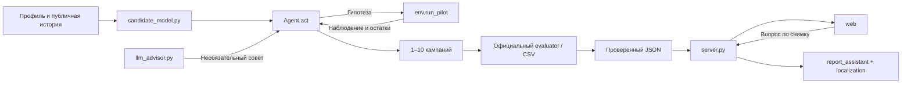

# Архитектура Tariflow

Один `Agent` управляет циклом исследования и распределения ресурсов. Веб и OpenAI
не являются зависимостями официального автономного запуска.

## Модули

| Модуль | Ответственность |
|---|---|
| `agent.py` | Кандидаты, пилоты, обновление оценок, ресурсы и финальный план |
| `candidate_model.py` | Исторические приоры и выразимые сегменты |
| `llm_advisor.py` | До двух советов initial/feedback, строгий формат и fallback |
| `scripts/export_report.py` | Публичный evaluator, валидация и атомарная запись JSON |
| `server.py` | Loopback HTTP API, один расчёт и один ответ одновременно |
| `report_assistant.py`, `report_localization.py` | Сводка по фактам, ссылки и RU/KK |
| `web/` | Просмотр, запуск, вопросы и локальный импорт отчётов |
| `scripts/package_submission.py` | Standalone-агент, CSV, документы и manifest |

## Кандидаты

`build_candidates(profile, tariffs, data_dir) -> list[dict]` получает две DataFrame
и путь к разрешённой истории. Функция не меняет данные, не проводит пилоты и не
вызывает LLM. Кандидат содержит `filters`, `target_tariff`, `audience_size`,
`arpu_sum`, `prior_lift_ratio`, `prior_n`, `rationale` и стабильный `candidate_id`.

Агент заново вычисляет аудиторию и ARPU по фильтрам, проверяет существование тарифа,
размер 10–5000 и отсутствие перехода в текущий тариф. Нельзя обрезать группу и
заявлять фильтр с другим охватом. История ранжирует гипотезы, но после пилота получает
не более пяти псевдонаблюдений. Ошибка модуля включает встроенные ценовые гипотезы
и отражается в предупреждениях. Подробности — [анализ](../analysis/README.md).

## Пилоты и выбор плана

Публичный вход: `env.customer_profile`, `tariffs`, `channels`, остатки ресурсов,
`pilots_left`, `run_pilot` и собственная `pilot_history`. Внутренности среды не читаются.
После каждого пилота агент перечитывает остатки. Стоимость не списывается повторно.

По умолчанию используются baseline/template/fixed: первые scout-пилоты до 150,
повторные до 200, затем до четырёх слотов для проверки платного канала.
Опубликованные множители помогают ранжировать новые каналы; для включения кампании
нужны её собственные наблюдения. Резервируется стоимость пары пилотов и финальной
кампании, а расходы проверки каналов ограничены долей оставшегося бюджета.

Обычный портфель содержит положительные осторожные оценки с двумя завершёнными
пилотами того же кандидата и канала. Для небольшого пула перебираются совместимые
наборы без пересечения аудиторий, с соблюдением бюджета, контактов и лимита кампаний.
При равенстве сохраняется жадный набор; при превышении границы поиска используется
ограниченный жадный выбор. Если положительного набора нет, обязательная одна кампания
возвращается с явным fallback-предупреждением. Истинная прибыль не гарантируется.

`Agent.act(env)` возвращает только допустимые поля: `target_tariff`, `channel`,
необязательные `campaign_name` и фильтры `filter_arpu_segment`, `filter_data_segment`,
`filter_call_segment`, `filter_current_tariff`. Пропуск фильтра снимает ограничение;
список текущих тарифов разделяется `;`. Метаданные идут отдельно в `last_report`.

## Отчёт, API и объяснения

[Схема отчёта](REPORT_SCHEMA.md) отделяет наблюдения, прогноз финального плана и
измеренный итог симуляции. Экспортёр проверяет фактически возвращённые кампании,
ресурсы, пересечения и собственные пилоты, затем атомарно сохраняет JSON.
Provenance содержит SHA, состояние checkout и хеши входов, но не секреты.

Сервер на `127.0.0.1:8765` создаёт снимок только после успешного расчёта. Браузер
не передаёт команды, пути или ключи. HTTP-контракт, ограничения и source refs —
[API](API.md). Отдельный статический viewer поддерживает импорт без серверного чата.

Числовая сводка ответа строится сервером. Вопрос о конкретной кампании ограничивает
источники её собственными наблюдениями. OpenAI получает агрегаты и добавляет
качественный комментарий; при ошибке или отклонении ответа работает fallback.
История вопросов хранится в UI, но каждый запрос обрабатывается отдельно.

## Конфигурация и поставка

`OPENAI_API_KEY` — только окружение, `OPENAI_MODEL` — выбор модели,
`ARPU_OFFLINE=1` — принудительно автономный режим. Вызовы и таймауты ограничены.
Конфигурация ключа не считается доказательством принятого совета.

Standalone встраивает собственные candidate/advisor-модули, сохраняя стратегию.
Пакет содержит точные байты официального CSV, зависимости и связанные документы;
manifest перечисляет файлы и SHA-256. Исходные данные нужны в среде исполнения.
Локальные заметки и кеши не упаковываются. Команды — [README](../README.md).

Опциональные `exploration_policy=balanced|confirmation_first`,
`uncertainty_mode=empirical`, `pilot_sizing=adaptive` предназначены для повторения
экспериментов. Они не прошли условия замены default; [результаты](VALIDATION.md).
