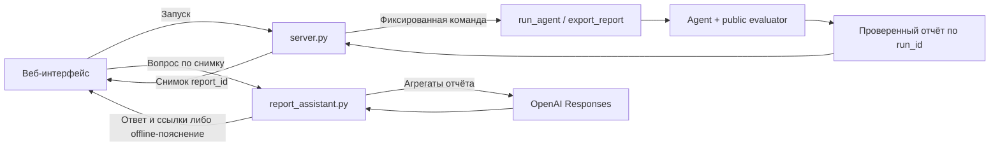

# ARPU Compass — архитектура и договорённости v1

## Контекст и границы

Основная среда запуска — скрипты организаторов в корне репозитория. Они импортируют `from agent import Agent`, без опции --agent. Пакет участника скопирован в корень без изменения файлов. Оригинальная распакованная папка сохранена локально как резерв и не дублируется в Git.

Публичный вход: `env.customer_profile`, `env.tariffs`, `env.channels`, `env.remaining_budget`, `env.remaining_contacts`, `env.pilots_left`, `env.run_pilot(...)`, `env.pilot_history`. Внутренние эффекты и реализацию среды не использовать для построения стратегии. Запуск официального evaluator разрешён.

## Владение файлами

| Владелец | Файлы | Ответственность |
|---|---|---|
| Дима | agent.py | Оркестрация, пилоты, адаптация, финальные кампании, Agent.last_report |
| Дима | server.py, report_assistant.py, docs/API.md | Локальный API, запуск расчётов, снимки и ответы OpenAI по отчёту |
| Дима | scripts/, requirements.txt, .gitignore, .env.example | Запуск, проверки, общий состав/зависимости и безопасные checkpoint |
| Дима | docs/PROJECT.md, ARCHITECTURE.md, HACKATHON_RULES.md, WORK_PLAN.md | Общая спецификация и интеграция договорённостей |
| Азим | candidate_model.py, analysis/ | Схемы разрешённых CSV, исторические приоры и кандидаты |
| Азим | web/, README.md (после стартового коммита) | Веб-представление реального отчёта, воспроизводимость и демо |
| Дима | llm_advisor.py | OpenAI-советник гипотез и пересмотра пилотов; приоритет повышен прямым поручением пользователя |
| Каждый свой | docs/agents/<me>/, свой раздел STATUS | Личная координация |
| Организаторы | environment.py, mock_environment.py, scoring_core.py, local_eval.py, make_submission.py, agent_template.py, исходные CSV/guide | Не изменять ради улучшения оценки или обхода проверки |

Это распределение согласовано текущим поручением подготовить план на двоих. Азим подтверждает принятие зоны в своём STATUS; Дима не редактирует его личный раздел. Пока Азим не подключился, базовый агент должен работать самостоятельно.

## Поток

`profile + public history -> candidates/prior -> pilot -> update estimates -> next pilot or allocate -> validate -> campaigns`

`campaigns -> official evaluator / make_submission -> CLI score / submission.csv`

`Agent.last_report -> scripts/export_report.py -> проверенный JSON -> импорт в web`



HTTP-вызовы вопросов также проходят через server.py: диаграмма показывает назначение
модулей, а не прямой доступ браузера к Python/OpenAI. Ключ существует только на сервере.

UI не является зависимостью импорта Agent и официального запуска. Один оркестратор выбирает действия по обратной связи; внутренние модули не заявляются самостоятельными LLM-агентами.

## Контракт candidate_model.py

Азим реализует:

```python
def build_candidates(profile, tariffs, data_dir):
    """Return list[dict]; use public data only; no env calls or LLM calls."""
```

- profile: DataFrame, переданный env.customer_profile, только чтение.
- tariffs: DataFrame env.tariffs; использовать существующие tariff_plan_code.
- data_dir: pathlib.Path к публичному каталогу data; не искать закрытые файлы.
- Результат — ограниченный ранжированный пул гипотез перехода, без выбора канала и без пилотов.

Каждый кандидат:

```json
{
  "candidate_id": "stable-segment-target-id",
  "filters": {"filter_current_tariff": "tariff_N", "filter_arpu_segment": "HIGH"},
  "target_tariff": "tariff_M",
  "audience_size": 100,
  "arpu_sum": 123456.0,
  "prior_lift_ratio": 0.03,
  "prior_n": 42,
  "rationale": "Краткое описание наблюдаемой исторической опоры"
}
```

Это пример структуры, не настоящий результат и не предписанные тарифы/показатели. prior_lift_ratio — дробное относительное изменение ARPU из истории до поправки на канал; 0.03 означает +3%. prior_n — число исходных наблюдений, не гарантия переноса эффекта на целевую выборку. Для отсутствующей истории: слабый/нулевой приор, prior_n=0, причина в rationale.

filters содержит только разрешённые фильтры. audience_size и arpu_sum рассчитываются из целевой базы ровно для этих фильтров. Не выдавать набор выбранных ID, если формат кампании не умеет его выразить. Большие сегменты делить разрешёнными фильтрами, не обрезать DataFrame и не сообщать фиктивный охват. При пустых данных вернуть []. Функция не изменяет profile, не пишет на диск, не проводит пилоты, не зашивает скрытые эффекты.

Дима сначала использует собственную простую генерацию; после первого коммита Азима подключает контракт. Ошибка необязательного data-модуля должна быть видна в отчёте и включать базовую генерацию.

Текущая реализация: импорт выполняется автоматически; build_candidates получает ровно три аргумента. Не доверяем переданным audience_size/arpu_sum: пересчитываем их по filters. Любой кандидат, содержащий абонента уже на target_tariff, отклоняется. Внутренний ID Дима вычисляет стабильно из фильтров и цели. Без модуля source=builtin_price_hypotheses: узкие current/arpu/data/call группы и два ценовых варианта. Историческая медиана в этом fallback только описательная: попытка напрямую переносить её ухудшила устойчивость. Подключённый prior Азима получает максимум 5 псевдонаблюдений с ограниченной величиной относительно пилотов.

## Контракт Agent и кампаний

```python
class Agent:
    def act(self, env) -> list[dict]: ...
```

Обязательные поля кампании: `target_tariff`, `channel`. Разрешённые дополнительные поля: `campaign_name`, `filter_arpu_segment`, `filter_data_segment`, `filter_call_segment`, `filter_current_tariff`. Пропуск фильтра означает отсутствие ограничения. Формат объединения тарифов через `;` показан в guide. Нельзя добавлять неподдерживаемый параметр числа клиентов финальной кампании: контроль через выражаемые фильтры.

Пилот: обязательны target_tariff, channel, n_customers; фильтры — по публичной сигнатуре. Шаблон публично читает `result['observed_lift_ratio']`. Поля размера/дисперсии/ошибок и точную семантику коэффициента канала выяснять по возвращаемым результатам нормального запуска или публичным пояснениям, не по закрытым эффектам.

Перед каждым пилотом проверять доступные ресурсы, размер сегмента и срок исполнения; после пилота перечитывать остатки среды. Финальный план учитывать по остаткам после разведки. Для повторных контактов стоимость не исчезает от дедупликации эффекта.

## Отчёт для веба v1

`Agent.last_report` — JSON-совместимый dict; выгрузка отдельным локальным скриптом, а не частью обязательного CSV. Минимум:

- schema_version: "1.0";
- engine: имя стратегии;
- campaigns: возвращённые словари кампаний;
- pilots: выполненные публичные запросы и наблюдённый observed_lift_ratio;
- resources: remaining_budget, remaining_contacts, pilots_left;
- пояснения/предупреждения и оценки — необязательны, UI допускает их отсутствие.

Скрипт экспорта дополняет seed, время запуска и метку synthetic. Прибыль показывать только когда она получена от публичного evaluator; в иных случаях поле отсутствует/null. Не подменять её pilot ratio или предполагаемой прибылью. Снимок успешного прогона имеет метку «Сохранённый прогон», а искусственная фикстура — «Демонстрационные данные».

Основной веб уже запускает расчёт и задаёт вопросы через локальный server.py на8765.
Снимок создаётся только после собственного успешного расчёта; произвольные команды,
пути и пользовательские JSON сервер не принимает. Импорт через input type=file
сохранён как независимый viewer и резервный путь на статическом сервере8080.
Контракт, режимы, таймауты и refs описаны в API.md; браузер не является зависимостью Agent.act.

### Подтверждённый портфель кампаний

В обычный финальный набор допускаются только положительные conservative_net и
минимум два завершённых пилота того же кандидата и канала. При20пилотах таких
вариантов максимум10, поэтому bounded exact search перебирает совместимые наборы.
Цель — сумма приблизительных conservative_net; ограничения — непересекающиеся
аудитории, остатки бюджета/контактов, не более10кампаний. При равенстве сохраняется
прежний greedy-набор. Если вход неожиданно содержит больше10 подтверждённых вариантов,
используется ограниченный greedy. Это оптимизация оценки, не гарантия истинной прибыли.

Необязательный report.portfolio_selection содержит mode, eligible_count,
baseline_conservative_net, selected_conservative_net, improved. Он относится
к положительному подтверждённому набору до обязательного fallback. Если набора нет,
одна минимально необходимая кампания остаётся отдельно помеченной fallback/warning.
validation.portfolio проверяет фактически возвращённые кампании, пересечения по
публичному профилю, соответствие allocation и пилотных записей. Записи пилотов
происходят из отчёта агента, а их общий счёт сверяется с evaluator; поле checked
не обещает независимого доказательства оптимальности по всем возможным гипотезам.

## Проверка и конфигурация

Официальные команды из корня: `python local_eval.py`, `python local_eval.py --runs 10`, `python make_submission.py`. Не редактировать runner ради соответствия стратегии. В локальном Codex Python доступен также через bundled executable; README для команды использует обычный Python 3.12 + venv.

OPENAI_API_KEY — только окружение, необязателен для автономного режима. OPENAI_MODEL — конфиг модели (по умолчанию gpt-4.1-mini-2025-04-14), ARPU_OFFLINE=1 принудительно отключает сеть. Проверки checkpoint всегда идут автономно и не расходуют API-кредит.

## OpenAI-советник

Владелец Дима. Advisor.recommend(candidates, observations, resources, phase) возвращает candidate_ids и краткое деловое summary; при сбое — пустой список. На initial влияет на гипотезы разведки, на feedback — на приоритет следующего пилота. Не может изменить параметры кампании или ресурсы. Не заявляем, что LLM гарантированно улучшает прибыль: это проверяемая гипотеза.

Максимум два вызова за Agent.act, каждый с сетевым таймаутом 15 секунд, без повторов; максимум 900 выходных токенов. До 24 агрегированных кандидатов и 20 наблюдений, без записей/ID абонентов. POST только https://api.openai.com/v1/responses; store=false, strict schema, разрешённые candidate_id проверяются локально. Ошибка/отказ/таймаут/нет ключа включает автономное ранжирование. Метаданные API содержат только фазу, статус, безопасную причину и счётчик токенов.

Безопасный локальный запуск: python -X utf8 scripts/run_agent.py --ask-key. Ключ вводится скрыто и живёт только в окружении этого процесса; файлы не создаются. При уже настроенном OPENAI_API_KEY достаточно python scripts/export_report.py. Для воспроизводимой официальной генерации CSV: ARPU_OFFLINE=1 и python make_submission.py; онлайн-совет может различаться между запусками даже при том же seed.

Источники API: [Structured Outputs](https://developers.openai.com/api/docs/guides/structured-outputs), [модель](https://developers.openai.com/api/docs/models/gpt-4.1-mini). Guide разрешает LLM; несогласованный комментарий шаблона покрывается автономным режимом.

## Дополнения к отчёту v1 (совместимые)

planned_resources — остатки после запланированных финальных кампаний; resources сохраняет прежний смысл «после пилотов». allocation — охват, расходы и оценки по кампаниям; это прогноз, не фактический score. events — короткие действия модулей, advisor — статусы API, warnings — ограничения. evaluation.net_arpu_gain добавляет exporter из публичного evaluator. Все поля, кроме обязательного минимума v1, интерфейс допускает отсутствующими. Выводить summary как текст, не интерпретировать HTML/Markdown или команды из модели.

Уточнение v1: успешный pilots[] дополнительно содержит requested_n, фактический n_customers из публичного ответа, cost по изменению остатка бюджета, observed_lift_total (может быть null), remaining_budget и remaining_contacts после пилота. Эти поля совместимы с предыдущими отчётами и необязательны для UI. Прогноз финальной кампании использует наблюдения только её канала: коэффициенты guide не доказывают переносимость шумного observed_lift_ratio между каналами. Для принятия основного плана требуется повторный пилот; отдельный fallback явно отмечается.

Проверка каналов: после разведки до четырёх слотов зарезервировано для пар пилотов платного канала на уже подтверждённых сегментах. Опубликованные множители применяются только для выбора проверяемой гипотезы; финальная оценка по-прежнему использует её собственные наблюдения. Расходы этой дополнительной фазы ограничены 20% бюджета, оставшегося после разведки; перед запуском резервируются два пилота и полная финальная кампания. В events[].action может появиться channel_check, поле channel необязательно. Схема1.0 и интерфейс кандидатов сохранены.

Exporter проверяет фактически возвращённый план, согласованность обоих этапов ресурсов и результат evaluator до публикации JSON. Запись атомарна: при технической ошибке ненулевой exit code, предыдущий output/report.json сохраняется. Отрицательный net сам по себе не считается технической ошибкой. Необязательные поля provenance (Git SHA/dirty, hashes кода, запрошенный и фактический режим) и validation позволяют отличить версии отчёта; секреты и окружение целиком не включаются. SHA/hashes фиксируются перед оценкой; mode — по реальному результату advisor. Прежние команды с --ask-key/--offline сохраняются.

Текущая разведка выбирает наиболее сильный по опубликованному множителю канал при условии, что худшая стоимость всех её пилотов (200 контактов каждый) <=15% начального доступного бюджета. Иначе самый дешёвый канал; реальные ограничения каждого пилота остаются обязательными. Стандартный пакет выбираетSMS. Необязательное поле scout_channel отражает выбор. Отсутствующий llm_advisor.py теперь включает автономный советник с reason=advisor_module_unavailable; модульная версия полного репозитория работает как прежде.

Standalone для сдачи создаёт scripts/package_submission.py в output/submission/: собственные модули загружаются из встроенного исходного текста в обычные Python module namespaces перед исходным agent.py. Внутренние файлы среды не встраиваются и не анализируются. Корневые модули остаются отдельными для совместной разработки; версия алгоритма одинакова. Вместе идут точные байты официального submission.csv/requirements и справочный manifest с хешами. Независимый запуск без helper-файлов воспроизвёл результат и CSV.

## Следующий этап: запуск и диалог из веба

По запросу пользователя23.09 начинаем развитие по docs/NEXT_STAGE.md. Дима владеет новыми server.py и report_assistant.py, а также контрактом docs/API.md. Азим исключительно владеет web/**, docs/DESIGN.md, docs/DEMO.md и README.md. Существующие candidate_model.py/analysis/ остаются его зоной, но на время сравнений заморожены. Свои STATUS/HANDOFF редактирует каждый сам.

Сервер на127.0.0.1:8765 обслуживает тот же frontend и ограниченныйAPI для запуска, статуса, чтения отчёта и вопросов по его фактам. Подробные структуры и состояния закреплены в API.md. Редизайн не должен ждать реализации backend: viewer/адаптивность/состояния разрабатываются на настоящем report1.0. Ключ хранится только в окружении сервера; в браузер не передаётся. Официальная standalone-поставка остаётся отдельной от веб-оболочки.

## Диагностика качества — совместимое расширение report1.0

Контракт необязательных selection_diagnostics, forecast_summary, strategy_config
и allocation.sample_std / empirical_se / template_uncertainty / uncertainty_method
описан в QUALITY_STAGE.md. Exporter проверяет счётчики по завершённым пилотам и
возвращённому плану. forecast_summary — только финальные кампании;
evaluation.scope=pilots_and_final_deduplicated. Их разность не является ошибкой
прогноза. Q&A использует числовую сводку из этих же полей; OpenAI получает её
источники и добавляет качественный комментарий. Старые отчёты без новых полей допустимы.

Agent() сохраняет baseline/template. Keyword-параметры exploration_policy=balanced
и uncertainty_mode=empirical предназначены для воспроизводимого исследования.
После отрицательных dev/holdout результатов они не включаются в обычном запуске.
Кандидаты, данные, Agent.act, CSV и HTTP-запросы неизменны. Результаты — QUALITY_RESULTS.md.

## Языки объяснений

Совместимое дополнение API: optional POST /api/chat language=ru|kk, default ru,
health.capabilities.chat_languages. report_localization.py переводит стандартные
числовые ответы, labels/warnings и маршрутизирует казахские вопросы к тем же
проверенным источникам. OpenAI получает исходный вопрос и нужную языковую инструкцию.
Числа, report_id, mode и машинные ссылки остаются неизменными. Клиент использует
capability для совместимости со старым сервером; контракт описан в API.md.

## Дополнительные экспериментальные режимы

До принятия gate Agent() сохраняет baseline/template/fixed. Опциональные
exploration_policy=confirmation_first и pilot_sizing=adaptive описаны в
QUALITY_FOLLOWUP.md. strategy_config.pilot_sizing необязателен; старыйJSON
допустим, UI не должен выводить выдуманное значение. ПубличныеHTTP/CSV неизменны.
